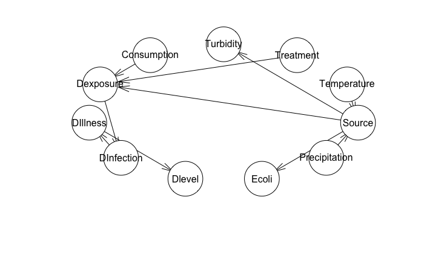
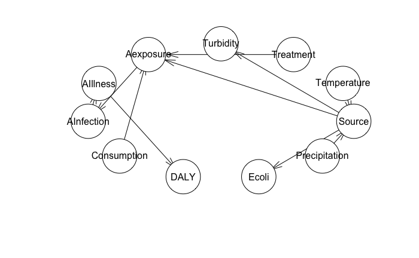
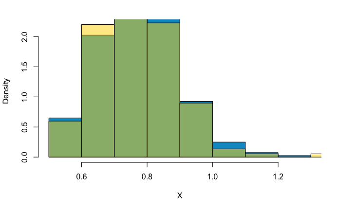
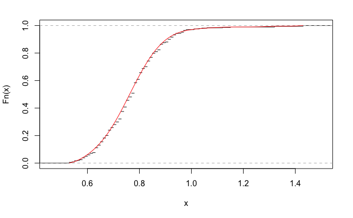
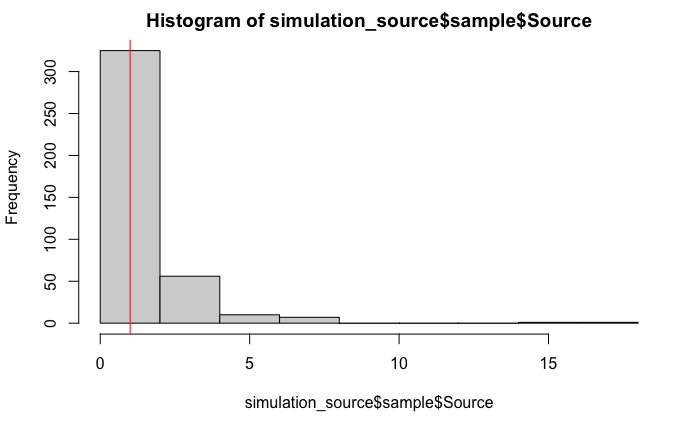
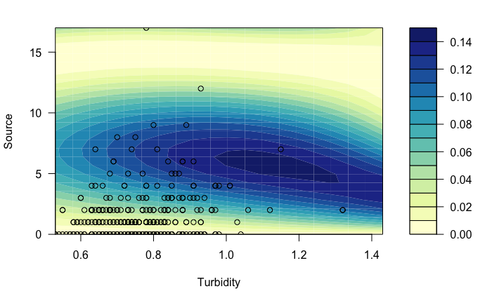
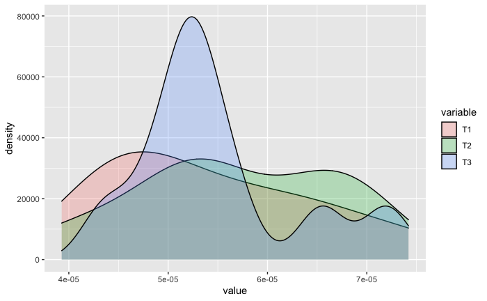
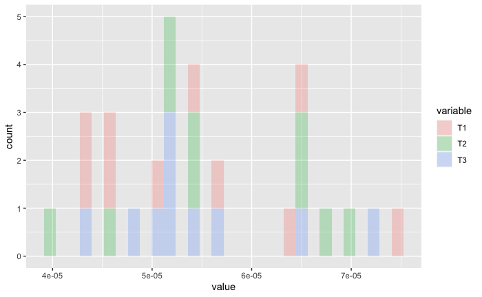
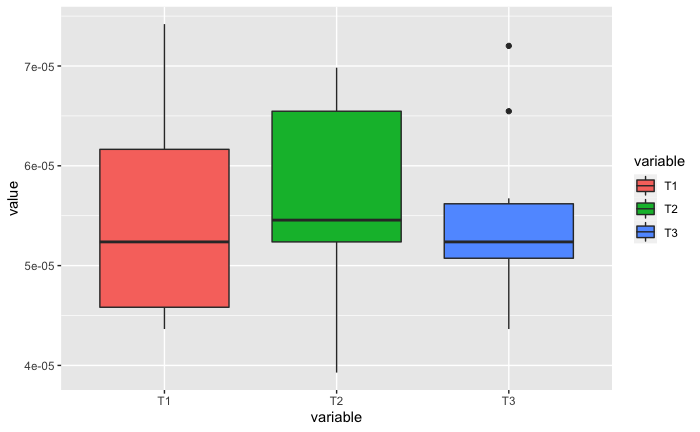

# BN_Giardia
## Data Merge
Merge the turbidity, temperature and precipitaion, crypto and giardia data sets, select relevant variables: Giardia, Turbidity, Temperature, Precipitation
## Data Augmentation
- Treatment  
Assume the probability of drinking water treatment plant breakdown is 0.01; Add a column "Treatment", by generating random variable from Bernoulli distribution B(368, 0.99) (368 is the data size)
- Consumption  
Drinking water consumption follows gamma distribution shape = 3.938; rate = 0.791: in glasses equalling 200 ml)(Säve-Söderbergh et al., 2018) Add a column"Consumption" by generating random variable from Gamma distribution Gamma(3.938, 0.791)\*0.2
- Daily Exposure(Dexposure)  
If the treament plant it working normally, there will be a 3log removal of Giardia(source/1000) 
Dexposure = Source/1000 * Consumption/50 (the unit of Giardia in source water is cysts/50L) 
If treament plant break down there will be no removal of Giardia 
Dexposure = Source * Consimption/50
- Annual Exposure(Aexposure)  
Aexposure denotes annual exposure to Giardia 
Aexposure = Dexposure \* 365
- Daily Risk of Infection(DInfection)  
P= 1 - exp (- rD), where P is the individual daily probability of infection, r is an organism-specific infectivity parameter (host-microorganism interaction), and D is the daily ingested dose of parasites. For Giardia, r = 0.02 (Zmirou-Navier et al. 200) 
- Annual Risk of Infection（AInfection)  
P(annual)=1-(1-DInfection)^365
- Daily Risk of Illness(DIllness)  
Case to infection ratio of Giardia is 0.4 
DIllness=DInfection\*0.4
- Annual Risk of Illness(AIllness)  
AIllness=AInfection\*0.4
- Daily Risk level(Dlevel) 
Two categories <0.00001(0.001%) and >=0.00001(0.001%)
- DALY 
DALY=LYL(life-years-lost)+YLD(years lived with a disability) 
LYL = (life expectancy − age at death) × severity weight × outcome fraction 
YLD per case = ΣOutcome fraction(duration of illness × severity weight) 
The DALYs per person per year is then calculated by multiplying the probability of illness per person per year by the DALYs per case of illness for each pathogen.  
DALY=((80.88-38.98)\*1\*0.00001+0.01918\*0.067\*0.99999)\*AIllness
## Mixtures of Truncated Basis Functions
MoTBFs is An R Package for Learning Hybrid Bayesian Networks Using Mixtures of Truncated Basis Functions:
https://journal.r-project.org/archive/2021/RJ-2021-019/RJ-2021-019.pdf
## Bayesian Network(Daily/Annual)
- Data separation 
Make two data sets: daily and annual.  
Daily set(df_daily) include: 
Precipitation,Temperature, Source, Turbidity, Ecoli, Treatment, Consumption, Dexposure, DInfection, DIllness, Dlevel 
Annual set(df_annual) include:
Precipitation,Temperature, Source, Turbidity, Ecoli, Treatment, Consumption, Aexposure, AInfection, AIllness, DALY
- Bayesian Structure 
Daily data set:   
Annual data set:  
## Model Validation
- Univariate 
Generate univariate(Turbidity in this case) by the MoTBFs function. Compare the generated turbidity values and the actual values. Examine the simulations both visually and by Kolmogorov-Smirnov test. 
 
Blue denotes the histograms of the simulations, gold denotes the histograms of the actual values. Green is the overlay part. 
 
Black denotes the cumulative distribution of turbidity, red donotes the cumulative distirbution of the simulations of turbidity. 
Two-sample Kolmogorov-Smirnov test is used. The p-value is 0.266 notably above 0.05, so there is no evidence to reject the null hypothesis that both samples are drawn from the same population.
- Simulations for source(Giardia) 
Randomly pick a record, observations are the values of rest variables, node to be predicted is "Source", and generate simulations by forward sampling 400 times. 
Histograms of generations and add a vertical line(actual source value of the record) 
 
- Probability Contour 
The joint probability of turbidity and source(source is the only parent of turbidity and turbidity does not have child). 
circles are the real data. 
 
## Scenario Analysis
- Climate change
Randomly sample 10 data records and increase temperatures by 0.5, 1, 1.5 (three fake datasetdf_rep1, df_rep2, df_rep3).
Observations are temperature and precipitation. Forward sampling 50 times and calcualte the mean as the DALY of each record. 
df_rep1$DALY, df_rep2$DALY,df_rep3$DALY are the desired values. Density plot, histograms, boxplots of the DALY of df_rep1, df_rep2, df_rep3 as follow: 
Density plots(T1-increase 0.5, T2-increase 1, T3-increase 1.5): 
 
Histograms: 
 
Boxplot: 
 
Original DALY mean is 4.420977e-07, changes are too big???
- Daily Heavy Rainfall 
Observation is the average daily precipitation plus 30mm. DIllness changes from 7.535699e-07 to 9.405421e-05(too big???)
- Water treatment plant breakdown 
Observation is treatment=0. DIllness changes from 7.535699e-07 to 9.903316e-05(big..)
## Reference
Säve-Söderbergh, M., Toljander, J., Mattisson, I., Åkesson, A., & Simonsson, M. (2018). Drinking water consumption patterns among adults—SMS as a novel tool for collection of repeated self-reported water consumption. Journal of exposure science & environmental epidemiology, 28(2), 131-139. 
Zmirou-Navier, D., Gofti-Laroche, L., & Hartemann, P. (2006). Waterborne microbial risk assessment: a population-based dose-response function for Giardia spp.(E. MI. RA study). BMC Public Health, 6(1), 1-9.
